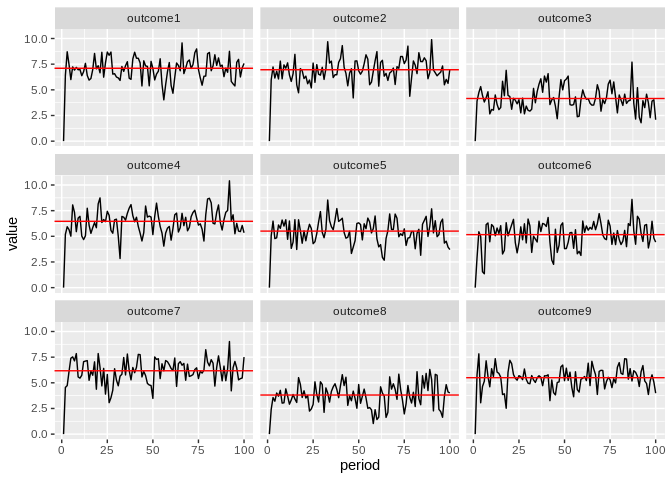

Unconditional Mean Simulation
================
Philipp Hunziker
June 5, 3030

Say we have some process

  
  
with  = 0") and  = E(X)") (X is stationary).

Julian has helpfully proposed that the unconditional mean of the outcome
is   
 = E(y) = (I - \\lambda I - \\rho W)^{-1} E(X) \\beta.
")  
Let’s check whether that pans out in
    simulations.

``` r
library(spmle)
```

    ## Warning: replacing previous import 'raster::maxValue' by 'maxLik::maxValue' when
    ## loading 'spmle'

``` r
library(ggplot2)
library(tidyr)
set.seed(42)

# Make some data
N <- 9
TT <- 100  # periods

W <- spmle::make_W_t(N)  # row normalized
X_means <- runif(N)*3  # means for the first predictor, for each unit
X_ls <- lapply(1:TT, function(i) {cbind(1, matrix(rnorm(N, X_means, 1), N, 1))})
X_expectation <- Reduce('+', X_ls)/TT  # E(X)

# Set parameters
beta <- c(1, 1)
rho <- 0.25
lambda <- 0.25

# Compute unconditional outcome mean
Y_unconditional <- solve(diag(N) - diag(N)*lambda - rho*W)%*%X_expectation%*%beta

# Simulate process
ymat <- matrix(NA, TT, N)
ymat[1,] <- rep(0, N)  # initial Y
M <- solve(diag(N) - rho*W)
for (tt in 2:TT) {
  ymat[tt,] <- M%*%(X_ls[[tt]]%*%beta + lambda*ymat[tt-1,])
}

# Plot the mofo
ysim_df <- as.data.frame(ymat)
outcome_names <- paste0('outcome', 1:N)
names(ysim_df) <- outcome_names
ysim_df$period <- 1:TT
plot_tb <- ysim_df %>% pivot_longer(-period, names_to = "outcome")
yuc_tb <- tibble(outcome = outcome_names, value = as.vector(Y_unconditional))

ggplot(plot_tb, aes(period, value)) +
  geom_line() +
  geom_hline(data = yuc_tb, aes(yintercept = value), color = 'red') +
  facet_wrap(~outcome)
```

<!-- -->

Looks good\!
